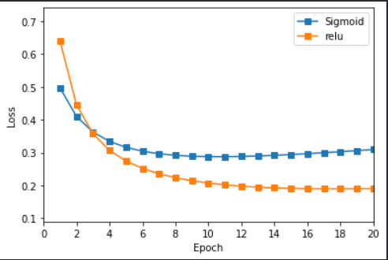
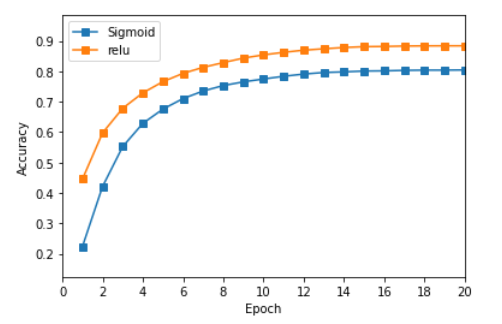
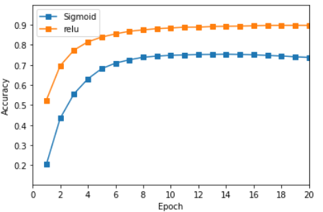
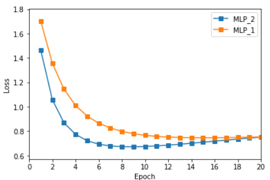
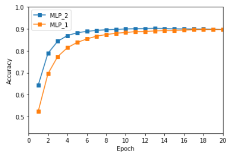
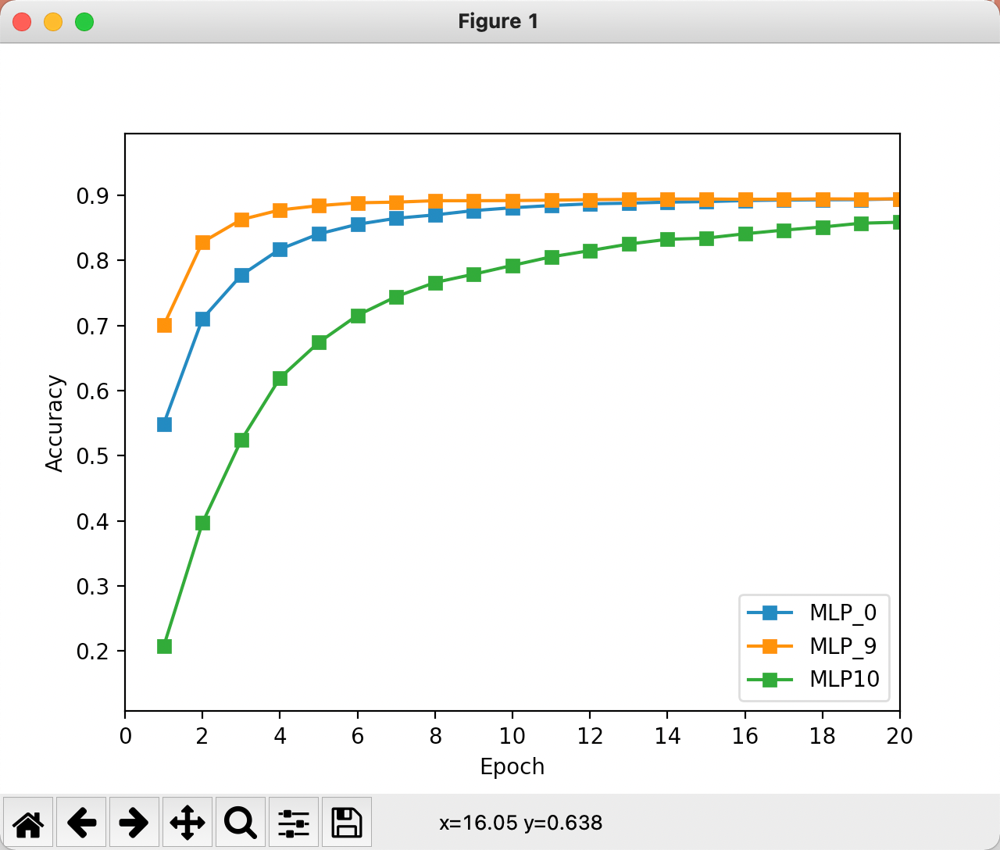
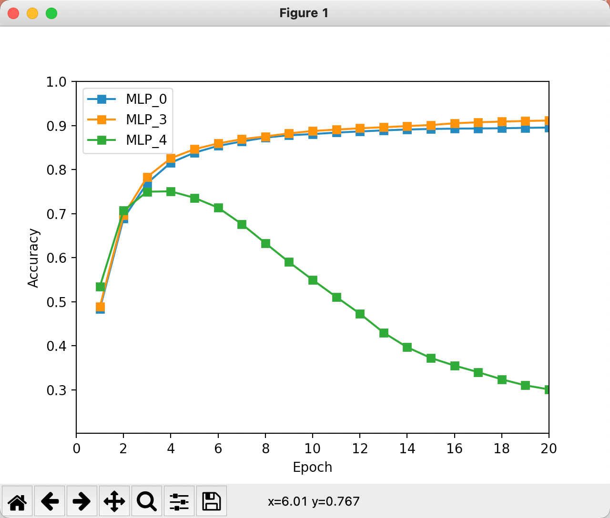
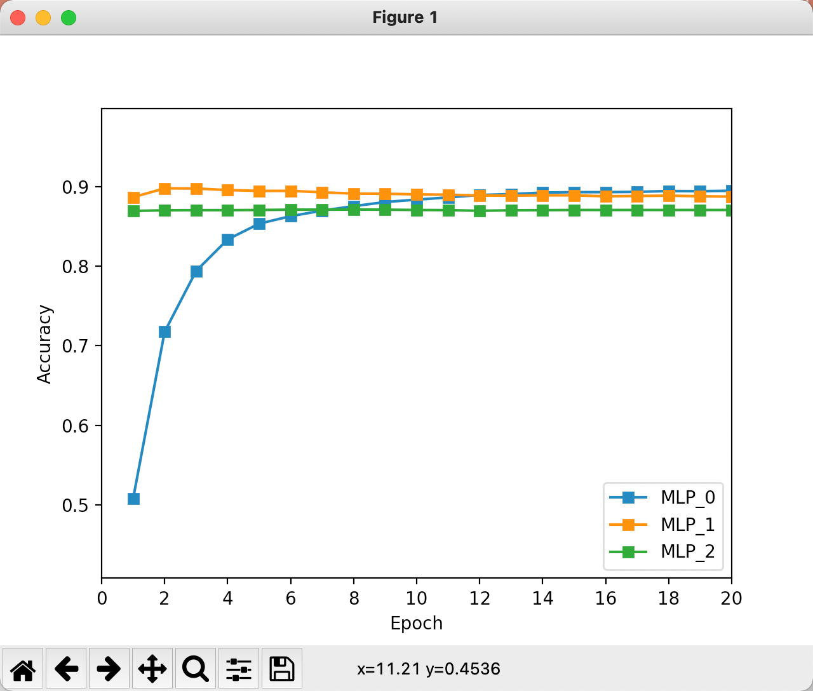

# MNIST Classification with MLP

​																何东阳 自96 2019011462

## 实验结果记录

### 方差损失

**代码见附件**

#### Sigmoid激活层

- 训练集准确率：**0.75-0.8**
- 测试集准确率：**0.78**

#### ReLU激活层

- 训练集准确率：**0.85-0.9**
- 测试集准确率：**0.86**

#### 训练集loss与accuracy图

<table>
    <tr>
        <td>
        
        </td>
    	<td>
        
        </td>
    </tr>
</table>

### 交叉熵损失

**代码见附件**

#### Sigmoid激活层

- 训练集准确率：**0.7-0.75**
- 测试集准确率：**0.7161**

#### ReLU激活层

- 训练集准确率：**0.85-0.9**
- 测试集准确率：**0.8674**

#### 训练集loss与accuracy图

<table>
    <tr>
        <td>
        
        </td>
    	<td>
         
        </td>
    </tr>
</table>

## 损失函数对比

从实验的损失图与准确率图中我们可以得到对比结果：

1. **训练时间**：两者达到收敛的时间近似，都是在**7轮**左右的训练时间时达到收敛。
2. **收敛程度**：经过足够的学习，两者都收敛，且收敛程度相差不大，都收敛的比较好，这可能是因为实验的任务比较简单。但相比之下，**交叉熵损失**的收敛稳定一点。
3. **准确率**：两个损失函数的准确率也差别不大，但是在使用**Sigmoid**作为激活层时，交叉熵损失的训练集准确率和测试集准确率都比方差损失小了**5%左右**，说明**选择Sigmoid作为激活层时，损失函数选择交叉熵损失效果不太好**。

## 激活层对比

通过实验结果我们可以做出如下对比：

1. **训练时间**：无论选择哪种损失函数，Sigmoid函数和ReLU函数的训练时间都差别不大，在7轮左右时收敛。这可能是因为a. 任务简单 b. 数据量适中，因此难以在不大的复杂度下做出区别。
2. **收敛程度**：两个激活层的收敛效果都很好，但经过仔细的对比，我认为Sigmoid函数在训练轮数增大时有稍微的倾斜，而ReLU更为稳定。
3. **准确率**：两个激活层主要的差别就体现在准确率上。无论是选择哪种损失函数，选择ReLU作为激活层得到的训练集准确率都比选择Sigmoid作为激活层的训练集准确率高，而且在交叉熵损失作为损失函数时这种差异更明显。**说明ReLU在本任务上比Sigmoid更适合作为激活层函数。**

## 双隐藏层设计

设计双隐藏层的MLP结构时，我选择了**ReLU函数**作为激活层，以**交叉熵损失**作为了损失层，第一层隐藏层有**400**个单元，第二个隐藏层有**128**个单元。

### 代码

```python
criterion = SoftmaxCrossEntropyLossLayer()
sgd = SGD(learning_rate_SGD, weight_decay)
reluMLP = Network()
# Build MLP with FCLayer and SigmoidLayer
# 128 is the number of hidden units, you can change by your own
reluMLP.add(FCLayer(784, 400))
reluMLP.add(ReLULayer())
reluMLP.add(FCLayer(400, 128))
reluMLP.add(ReLULayer())
reluMLP.add(FCLayer(128, 10))
```

### 与单层结构对比

我选择的单层结构损失函数也是使用的交叉熵函数，激活层函数也是使用的ReLU函数，隐藏层有128个单元。

<table>
    <tr>
        <td>
        
        </td>
    	<td>
      
        </td>
    </tr>
</table>

通过结果图对比我们可以得出：

1. **训练时间**：两个结构的MLP收敛时间大致相同，都是在7轮左右时稳定。
2. **收敛程度**：两个结构的收敛性都叫好，都能达到稳定地训练结果。
3. **准确率**：双层结构在训练初期比单层结构的准确率更高，效果更好，但是经过足够的训练两个结构的准确率都比较高，都在90%左右。

## 超参数对比

我选择了助教提供的代码中，激活层为ReLU，损失函数为交叉熵损失的网络结构作为baseline对比。

### Batch_size对比

```python
# MLP_0
batch_size = 100
# MLP_9
batch_size_9 = 50
# MLP_10
batch_size_10 = 20
```




### Weight_decay对比

```python
# MLP_0
weight_decay = 0.1
# MLP_3
weight_decay_3 = 0.01
# MLP_4
weight_decay_4 = 0.5
```




### Learning_rate对比

```python
# MLP_0
learning_rate_SGD = 0.001
# MLP_1
learning_rate_SGD_1 = 0.01
# MLP_2
learning_rate_SGD = 0.1
```




### 总结

学习率对于训练的影响相对来说更大（大的学习率更新的更快），weight_decay取的过大时训练无法收敛，batch_size越大，训练的越快。此处的超参数对比分析与上次作业类似，因此略去。
